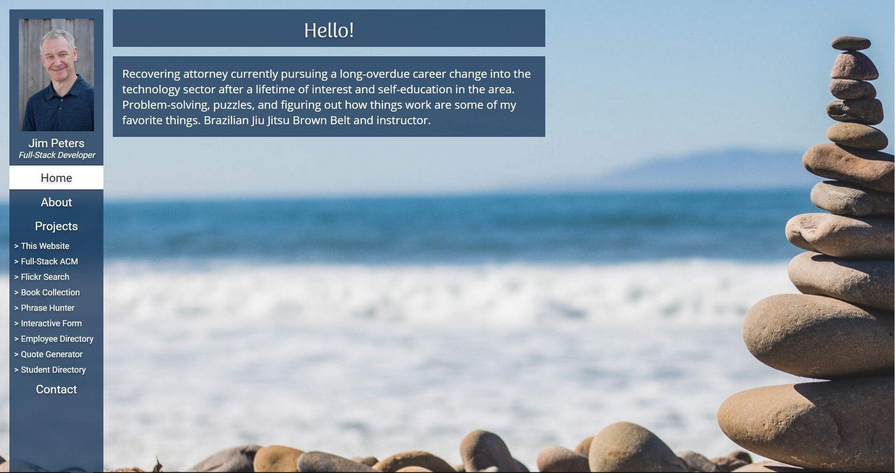

# My Portfolio

This is my portfolio website that I developed after the completion of my Treehouse Full-Stack JavaScript bootcamp.

A live demo can be found [here](https://www.jimpeters.dev/).

## Table of Contents

* [General Info](#general-information)
* [Technologies Used](#technologies-used)
* [Features](#features)
* [Screenshots](#screenshots)
* [Contact](#contact)

## General Information

- The site is written in ReactJS and deployed on Netlify.
- I designed it and wrote the code myself without the aid of any templates or pre-written components.
- I took the time to explore some of the latest web-design techniques and functions available.
- I also did a deep-dive into modern typography, graphic design and learning Figma.

## Technologies Used

- React
- HTML
- CSS

## Screenshots

## Contact

Created by [@jimjitsuesq](https://www.jimpeters.dev/).  Feel free to contact me!